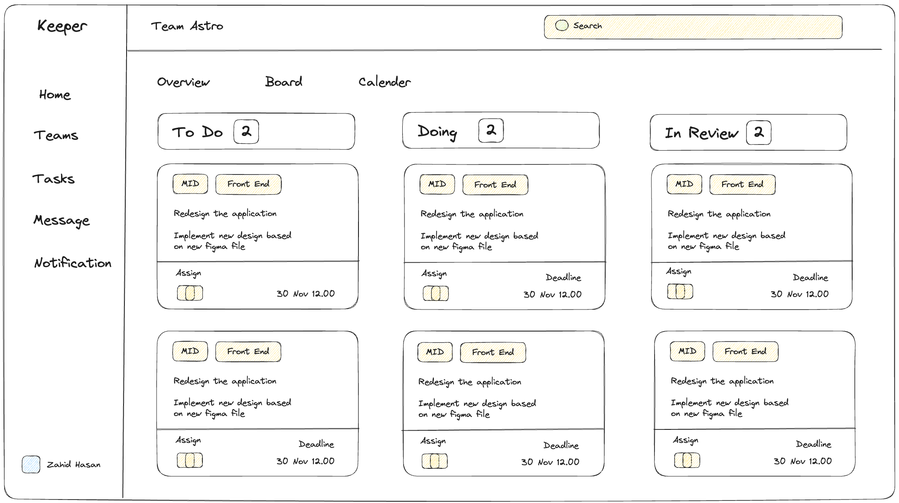

# Your To-Do List App

A simple and efficient to-do list application built with Next.js, Tailwind CSS, and TypeScript.



## Features

- Add, edit, and delete tasks
- Mark tasks as completed
- Responsive design for various devices

## Technologies Used

- [Next.js](https://nextjs.org/) - React framework for building web applications
- [Tailwind CSS](https://tailwindcss.com/) - A utility-first CSS framework
- [TypeScript](https://www.typescriptlang.org/) - Typed superset of JavaScript

## Getting Started

### Prerequisites

- Node.js and npm installed on your machine

### Installation

1. Clone the repository:

   ```bash
   git clone https://github.com/your-username/your-to-do-list-app.git
   ```
